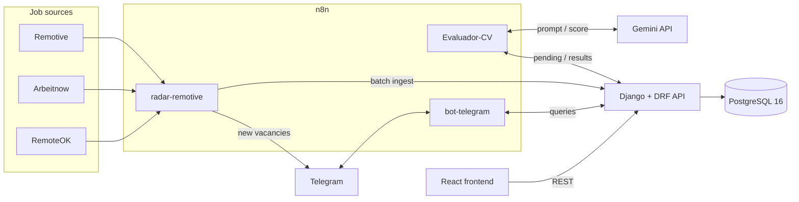
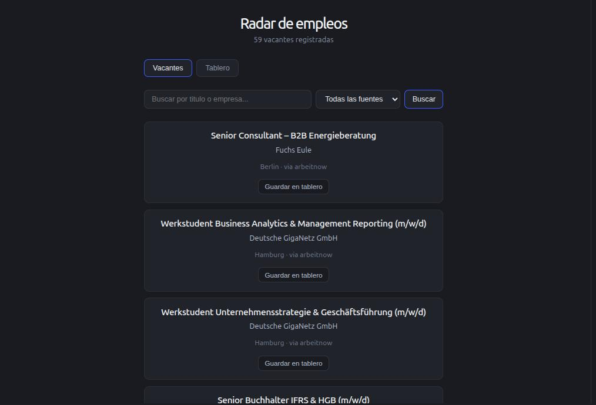
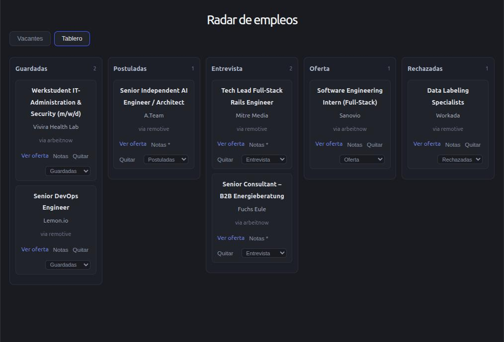
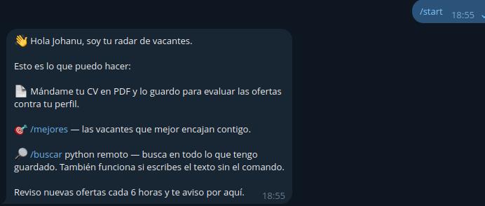

# Job Radar

Job hunting for remote tech roles means checking the same boards every day,
skimming hundreds of irrelevant postings and losing track of where you applied.
Job Radar automates that loop end to end: it collects vacancies from public job
APIs every few hours, deduplicates them, scores each one against my CV with an
LLM, notifies me on Telegram only when something new and relevant appears, and
tracks my applications on a kanban board.

I built it to use it myself while looking for work, and as a portfolio piece
that exercises a full stack: a scheduled data pipeline, a REST API, an AI
scoring step, a chat bot and a web UI.

<!-- demo video: paste link here -->

## Architecture



## Stack

| Layer | Technology | Why |
| --- | --- | --- |
| Backend | Django + DRF | Mature ORM and migrations; DRF serializers keep the ingest contract explicit |
| Database | PostgreSQL 16 (Docker) | Uniqueness enforced at the DB level (URL hash, one application per vacancy+profile) instead of in application code |
| Automation | n8n (Docker) | Scheduled pipelines and the Telegram bot as visual, exportable workflows — no cron scripts to maintain |
| AI | Gemini (`gemini-3.5-flash-lite`) | Cheap and fast enough to score batches of vacancies against a CV on a schedule |
| Frontend | React + Vite | Small SPA; no router or state library needed at this size |
| Notifications | Telegram | I already live there; the bot doubles as a query interface from my phone |

## n8n workflows

**radar-remotive** runs every 6 hours. It queries three sources in parallel
(Remotive, Arbeitnow filtered to remote tech roles, RemoteOK), normalizes each
provider's fields into a common schema in its own Code node, merges the
batches and POSTs them to the ingest endpoint. The API answers with how many
were new versus duplicates, and a Telegram message is sent only when something
new arrived. Adding a source means adding one HTTP node and one normalizer —
the backend never changes.

**Evaluador-CV** runs every 6.5 hours, offset from the collector. It asks the
API for vacancies not yet scored for my profile (together with my CV text),
builds one prompt per vacancy, calls Gemini, parses the structured answer
(score 0–100 plus reasons) and saves the evaluations back through the API.
Scoring is idempotent: a vacancy+profile pair is evaluated once.

**bot-telegram** is a Telegram-triggered workflow: a Code node detects the
intent of the incoming message and a six-way Switch routes it — help, best
matches, search (command or free text), CV upload as PDF (stored as profile
text), cover-letter draft for a vacancy, and a fallback. Every branch converges
on a single responder node.

## API

Write endpoints require an `X-API-Key` header matching `INGEST_API_KEY`.

| Method | Endpoint | Auth | Description |
| --- | --- | --- | --- |
| POST | `/api/vacantes/ingest/` | key | Batch ingest; deduplicates by SHA-256 of the URL |
| GET | `/api/vacantes/` | public | Paginated listing; filters `q` and `fuente` |
| GET | `/api/vacantes/<id>/` | public | Vacancy detail |
| POST | `/api/perfil/` | key | Upsert profile by Telegram chat id (CV text, keywords) |
| GET | `/api/perfil/<chat_id>/pendientes/` | key | Vacancies not yet scored for the profile, with CV text |
| GET | `/api/perfil/<chat_id>/mejores/` | public | Best matches; `?min=` score threshold |
| POST | `/api/evaluaciones/` | key | Save AI scores (upsert per vacancy+profile) |
| GET | `/api/perfil/<chat_id>/carta/<vacante_id>/` | key | Context bundle for cover-letter generation |
| POST | `/api/cartas/` | key | Save a cover-letter draft (upsert) |
| GET | `/api/perfil/<chat_id>/postulaciones/` | public | Applications on the kanban board |
| POST | `/api/postulaciones/` | key | Save a vacancy to the board |
| PATCH / DELETE | `/api/postulaciones/<pk>/` | key | Update state/notes (state changes are logged) or remove |

## Screenshots

Vacancy listing with search and filters:



Kanban board for application tracking:



Telegram bot:



## Running it locally

Requirements: Docker, Python 3.14+, Node 20+.

Each part has its own `.env`; copy every `.env.example` next to it and fill in
the values (`INGEST_API_KEY` must match between `backend/.env` and
`frontend/.env`).

```bash
# PostgreSQL (port 5433)
cp .env.example .env
docker compose up -d

# Backend
cd backend
cp .env.example .env
python -m venv .venv && source .venv/bin/activate
pip install -r requirements.txt
python manage.py migrate
python manage.py runserver

# Frontend (http://localhost:5173)
cd frontend
cp .env.example .env
npm install
npm run dev

# n8n (http://localhost:5678)
cd n8n
cp .env.example .env
docker volume create n8n_data
docker compose up -d
```

Then import the three JSON files from `n8n/` in the n8n UI (Workflows →
Import from file) and create the Telegram and Gemini credentials — they are
not included in the exports. The Telegram trigger needs `WEBHOOK_URL` to point
to a public tunnel (I use cloudflared) so Telegram can reach n8n.

## Known limitations and what I'd do differently

- **Single user by design.** Everything hangs off a Telegram chat id; there is
  no real authentication. With more time I'd add token auth and scope every
  query to the authenticated user.
- **Shared API key in the frontend.** The board writes with the same
  `X-API-Key` as the pipeline, which ends up in the JS bundle — acceptable for
  a local, personal deployment, not for a public one. Per-user tokens would
  fix this too.
- **No automated tests.** The API was verified manually (curl and browser).
  DRF's test client would pay for itself quickly here.
- **Some views parse JSON by hand** instead of using DRF serializers for
  input validation; I'd normalize that.
- **Synchronous ingest.** Fine at ~60 vacancies per run; a queue would be the
  next step if sources grow.
- **Not deployed yet.** The next milestone is a small VPS with the same Docker
  pieces plus HTTPS in front of the API.
